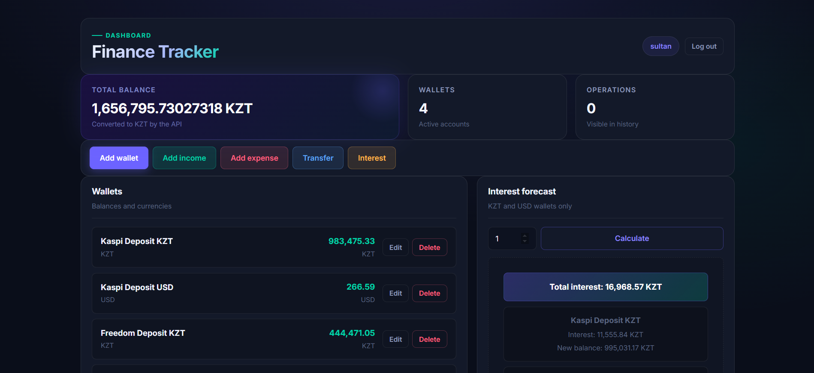
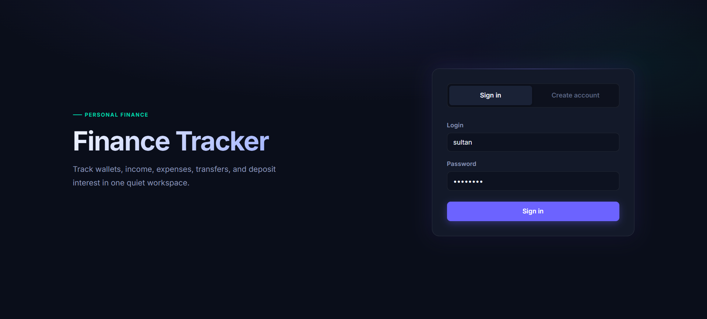
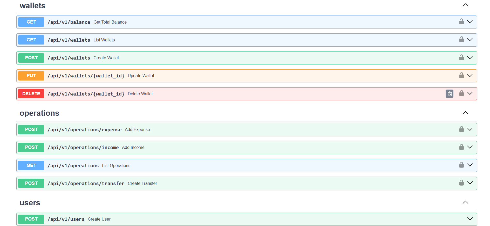

# Finance Tracker API

A personal finance tracking REST API built with **FastAPI**, **SQLAlchemy 2.0**, and **PostgreSQL**, with a lightweight vanilla JS frontend. Users can manage multiple wallets in different currencies, log income/expenses/transfers, and calculate compound interest on their balances.

**Live demo:** https://fastapi-service-642058528565.asia-southeast1.run.app/static/index.html

**Interactive API docs:** https://fastapi-service-642058528565.asia-southeast1.run.app/docs

> Built while learning FastAPI through tutorials, then extended with my own architecture, test suite, and cloud deployment.

---

## Screenshots

## Dashboard


## Sign in


## Swagger Docs



---

## Features

- **JWT authentication** — registration, login, and protected routes via OAuth2 password flow
- **Multi-wallet support** — create, update, and delete wallets in 5 currencies (KZT, USD, EUR, RUB, BTC)
- **Operations tracking** — income, expenses, and transfers between wallets, with full history and filtering by wallet/date range
- **Cross-currency transfers** — automatic conversion using a live exchange rate service
- **Interest calculator** — compound interest projection per wallet or across all eligible wallets, normalized to a single total
- **Aggregated balance** — total balance across all wallets converted to a common currency
- **Data isolation** — users can only ever see their own wallets and operations (enforced at the query level, covered by tests)

---

## Tech Stack

| Layer | Technology |
|---|---|
| API framework | FastAPI |
| ORM | SQLAlchemy 2.0 (typed `Mapped` columns) |
| Migrations | Alembic |
| Database | PostgreSQL ([Neon](https://neon.tech), serverless) |
| Auth | JWT (PyJWT) + Argon2 password hashing (pwdlib) |
| Validation | Pydantic v2 (field validators, `SecretStr` for secrets) |
| Testing | pytest, FastAPI `TestClient`, isolated SQLite test DB |
| Frontend | Static HTML / vanilla JS / Bootstrap (served by FastAPI) |
| Containerization | Docker (multi-stage build, non-root user) |
| Deployment | Google Cloud Run (`asia-southeast1`) + Artifact Registry |
| Package management | [uv](https://github.com/astral-sh/uv) |

---

## Architecture

The backend follows a layered architecture rather than putting everything in the route handlers:

```
Request
  │
  ▼
app/api/v1/*.py        ← routes: parse input, call services, return responses
  │
  ▼
app/service/*.py        ← business logic: validation rules, balance math, interest
  │                        calculations, orchestrating multiple repositories
  ▼
app/repository/*.py      ← data access only: SQLAlchemy queries, no business logic
  │
  ▼
app/models.py            ← SQLAlchemy ORM models (User, Wallet, Operation)
```

This separation keeps route handlers thin, makes business logic unit-testable without
spinning up HTTP requests, and keeps SQL/ORM concerns out of the service layer.

```
app/
├── api/v1/          # FastAPI routers (wallets, operations, users, interest)
├── service/         # Business logic layer
├── repository/       # Data access layer
├── models.py         # SQLAlchemy models
├── schemas.py         # Pydantic request/response schemas
├── enum.py            # CurrencyEnum, OperationType
├── database.py        # Engine / session setup
├── dependency.py       # FastAPI dependencies (get_db, get_current_user)
└── static/             # Frontend (HTML/CSS/JS)
tests/
├── conftest.py          # Fixtures: isolated test DB, user/wallet factories, auth headers
└── test_api/             # Endpoint tests per router
migrations/               # Alembic migration history
```

**Why this matters:** this structure means a developer can change
how a wallet is fetched from the database (repository layer) without touching the
business rule that says "you can't spend more than your balance" (service layer), and
without touching how that rule is exposed over HTTP (API layer).

---

## Security

- Passwords hashed with **Argon2** (via `pwdlib`), never stored or logged in plaintext
- JWTs signed with a secret loaded as a Pydantic `SecretStr` (never accidentally printed/logged)
- Login endpoint returns an identical error for "wrong username" and "wrong password" to avoid user enumeration
- All wallet/operation queries are scoped to `current_user.id` — verified by tests that create two users and assert one cannot see the other's data
- Docker image runs as a **non-root user**
- Security headers middleware (`X-Frame-Options`, `X-Content-Type-Options`, `Strict-Transport-Security` in production)
- `.env` is excluded from both git and the Docker build context

---

## Testing

Run with:

```bash
uv run pytest
```

The test suite uses an isolated SQLite database (separate from the dev/prod Postgres DB) with fixtures for users, wallets, and auth headers, and covers:

- Successful and failing paths for every endpoint (expense, income, transfer, wallet CRUD, interest)
- Input validation (negative amounts, empty names, same-wallet transfers)
- Authorization (missing/invalid tokens → 401)
- Business rules (insufficient funds → 400, wallet not found → 404)
- **Data isolation between users** — one user cannot view another user's operations
- Multi-currency transfers, with the exchange rate service mocked via `monkeypatch` so tests don't depend on a live external API

---

## Local Development

**Requirements:** Python 3.12+, [uv](https://github.com/astral-sh/uv), a PostgreSQL database (e.g. a free [Neon](https://neon.tech) project)

```bash
# Install dependencies
uv sync

# Configure environment
cp .env.example .env   # then fill in DATABASE_URL and secret_key

# Run migrations
uv run alembic upgrade head

# Start the dev server
uv run uvicorn main:app --reload
```

The app will be available at `http://127.0.0.1:8000`:
- Frontend: `http://127.0.0.1:8000/static/index.html`
- Swagger docs: `http://127.0.0.1:8000/docs`
- Health check: `http://127.0.0.1:8000/health`

### Environment variables

| Variable | Description |
|---|---|
| `DATABASE_URL` | PostgreSQL connection string |
| `secret_key` | Secret used to sign JWTs |
| `algorithm` | JWT signing algorithm (default: `HS256`) |
| `access_token_expire_minutes` | Token lifetime in minutes (default: `30`) |

---

## Deployment

The API is containerized with a multi-stage Dockerfile (build stage installs
dependencies with `uv`, production stage runs as a non-root user) and deployed to
**Google Cloud Run**, with the database hosted on **Neon** (serverless Postgres).

```bash
# Build and push the image to Artifact Registry
gcloud builds submit --tag asia-southeast1-docker.pkg.dev/<project-id>/<repo>/fastapi-app

# Deploy the new image to the existing Cloud Run service
gcloud run deploy <service-name> \
  --image asia-southeast1-docker.pkg.dev/<project-id>/<repo>/fastapi-app \
  --region asia-southeast1
```

The frontend is static HTML/JS served directly by FastAPI from the same origin
(`/static`), so it talks to the API via a relative URL (`/api/v1/...`) rather than a
hardcoded host — meaning the exact same static files work unmodified in both local
development and production.

---

## What I'd add next

A few things I'm aware are missing and would tackle in a v2:

- Pagination on the operations list endpoint (currently returns the full history)
- Rate limiting on the login endpoint
- Locking down CORS to a specific origin now that frontend/backend are co-located
- Structured logging / basic observability for the deployed service
